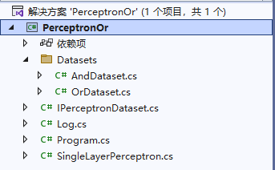
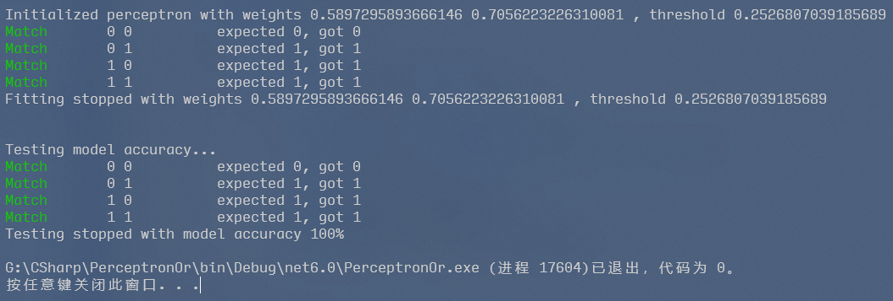
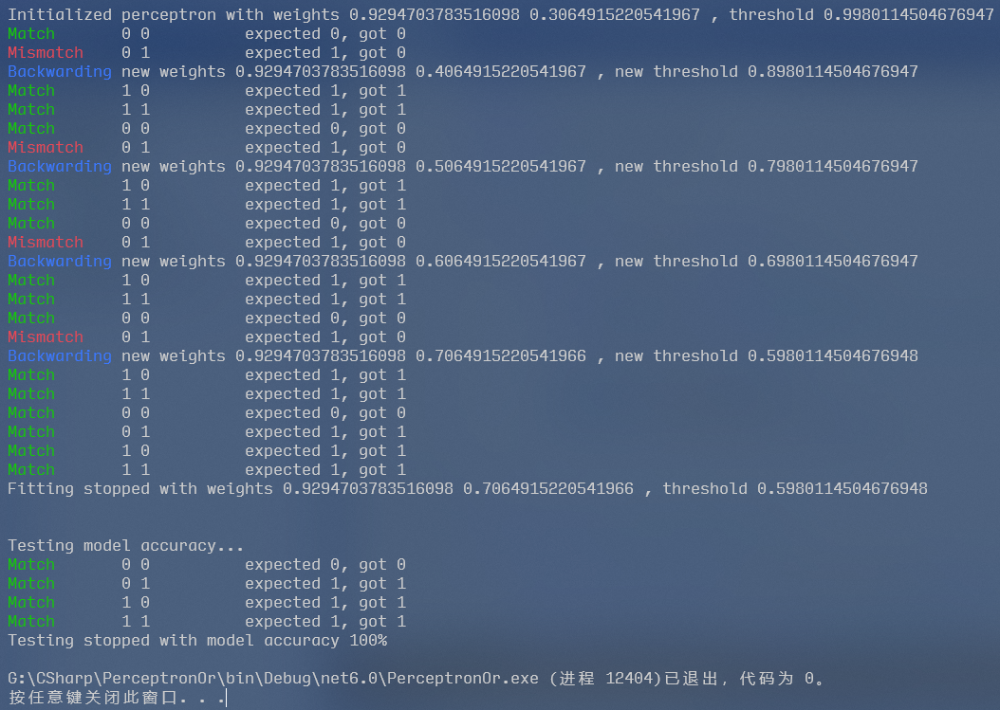
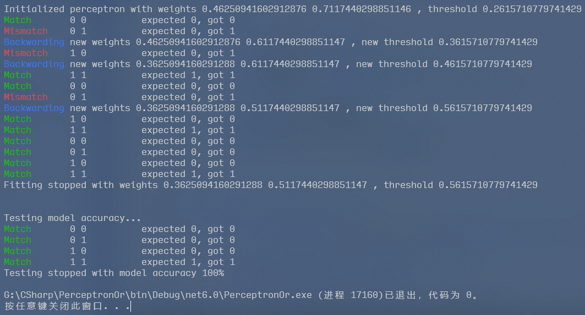

# 使用单层感知机实现“或”运算

<div style="text-align: center">
    20 网络工程 2 班&emsp;李政翱
</div>

---

## 目录

[TOC]

## 基本原理

---

### 感知器模型

单层感知机是一种只具有单层可计算节点的前馈网络，其网络拓扑结构是单层前馈网络。使用单层感知机的主要目的是为了对外部输入进行分类，设单层感知机有 $n$ 个输入，$m$ 个输出，则其判别超平面由下式决定：
$$
\sum_{i=1}^{n}w_{ij}x_i-\theta_j=0 \quad (j=1,2,\cdots,m)
$$
可以证明，单层感知机可以很好地解决线性可分问题。


### 感知器学习

单层感知器学习实际上是一种基于纠错学习规则，采用迭代的思想对连接权值和阈值进行不断调整，直到满足结束条件为止的学习算法。假设 $X(k)$ 和 $W(k)$ 分别表示学习算法在第 $k$ 次迭代时的输入向量和权值向量，并把阈值 $\theta(k)$ 作为权值向量中的第一个分量，对应地把 $-1$ 固定地作为输入向量中的第一个分量，则有
$$
\begin{align}
X(k)&=(-1,\space x_1(k),\space x_2(k),\space \cdots,\space x_n(k)) \\
W(k)&=(\theta(k),\space w_1(k),\space w_2(k),\space \cdots,\space w_n(k))
\end{align}
$$
即 $x_0(k)=-1,\space w_0(k)=\theta(k)$。

单层感知机学习是一种有导师学习，它需要给出输入样本的期望输出。假设一个样本空间可被划分为 A，B 两类，其激活函数的定义为：
$$
f(x)= \left\{
\begin{align}
1,\qquad &x\in A, \\
-1,\qquad &\text{otherwise}
\end{align}
\right.
$$
对应地，也可将期望输出（亦称为导师信号）定义为：当输入样本属于 A 类时，其期望输出为 $1$，否则其输出为 $-1$（或 $0$）。

在上述假设下，单层感知机学习算法可描述如下：

1. 设 $t=0$，初始化连接权值和阈值。即给 $w_i(0)\space(i=1,\space 2,\space \cdots,\space n)$ 及 $\theta(0)$ 分别赋予一个较小的非零随机数，作为它们的初始值。

2. 提供新的样本输入 $x_i(t)\space(i=1,\space 2,\space \cdots,\space n)$ 和期望输出 $d(t)$。

3. 计算网络的实际输出：
   $$
   y(t)=f\left( \sum_{i=1}^nw_i(t)x_i(t)-\theta(t) \right) \qquad(i=1,\space 2,\space \cdots,\space n)
   $$

4. 若 $y(t)=d(t)$，不需要调整连接权值，转到第 6 步；否则需要调整连接权值，执行第 5 步。

5. 调整连接权值：
   $$
   w_i(t+1)=w_i(t)+\eta[d(t)-y(t)]x_i(t)\qquad(i=1,\space 2,\space \cdots,\space n)
   $$
   式中，$0<\eta\le1$，是一个增益因子，用于控制修改速度。其值不能太大，也不能太小：如果 $\eta$ 的值太大，会影响 $w_i(t)$ 的收敛性；如果太小，又会使 $w_i(t)$ 的收敛速度太慢。

6. 判断是否满足结束条件，若满足，算法结束；否则，将 $t$ 值加 $1$，转第 2 步重新执行。这里的结束条件一般指 $w_i(t)$ 对一切样本均稳定不变。

<div class="breaker" />

## 代码实现

---

### 项目结构

本次作业采用 .NET 6 平台上的 `C#` 语言作为开发语言，使用 Visual Studio 2022 作为集成开发环境。项目采用多文件的组织结构，如下图所示：



<div style="text-align: center">
    <small>项目组织结构</small>
</div>

其中：

- **Datasets**：该文件夹下存放了两种数据集，分别为“与”运算数据集和或运算数据集。
  - **`AndDataset.cs`**：“与”运算数据集。
  - **`OrDataset.cs`**：“或”运算数据集。
- **`IPerceptronDataset.cs`**：感知机可接受的数据集一般接口，只要实现了该接口的类都可作为感知机的数据集使用。
- **`Log.cs`**：自定义的日志类，可实现控制台中清晰的日志输出。
- **`Program.cs`**：程序的入口类，其中包含了入口点 `Main` 方法。
- **`SingleLayerPerceptron.cs`**：单层感知机的实现类，包含了其预测（前向传播）与学习（反向传播）的核心算法。


### 数据集准备

数据集是机器学习的先决条件，没有数据集就没有学习的来源。为了使得代码拥有更好的灵活性与健壮性，本源码中首先定义了 `IPerceptronDataset` 接口，其对应文件源码如下：

<div style="text-align: center">
    <small>IPerceptronDataset.cs</small>
</div>

```c#
namespace PerceptronOr;

interface IPerceptronDataset
{
    int GetItemCount();
    (IEnumerable<int>, int) GetItem(int index);
}

static class PerceptronDatasetExtension
{
    public static IEnumerable<(IEnumerable<int>, int)> GetItems(this IPerceptronDataset dataset)
    {
        var items = new List<(IEnumerable<int>, int)>();
        for (var i = 0; i < dataset.GetItemCount(); i++)
        {
            items.Add(dataset.GetItem(i));
        }

        return items;
    }
}
```

其中，`IPerceptronDataset` 接口定义了两个函数：

- `GetItemCount`：返回该数据集中元素的个数。
- `GetItem`：返回位于指定索引值位置的“输入——输出”对。

数据集的“输入——输出”对中，“输入”表示将要输入感知机的元素集合，而输出则为期望感知机输出的单个整数。

紧接着 `IPerceptronDataset` 定义的是 `PerceptronDatasetExtension` 扩展类，用于给实现了 `IPerceptronDataset` 的数据集类增加一个扩展方法 `GetItems`，该方法会将数据集中所有的“输入——输出”对加入一个列表中并一次性返回。该方法简化了后续对数据集的遍历。


实现了 `IPerceptronDataset` 接口的两个数据集源文件放置于 Dataset 文件夹中。其中 `AndDataset.cs` 为“与”运算的数据集：

<div style="text-align: center">
    <small>Datasets / AndDataset.cs</small>
</div>

```c#
namespace PerceptronOr.Datasets;

class AndDataset : IPerceptronDataset
{
    readonly IEnumerable<int>[] feature =
    {
        new int[] {0, 0},
        new int[] {0, 1},
        new int[] {1, 0},
        new int[] {1, 1},
    };
    readonly int[] groundTruth = { 0, 0, 0, 1 };

    public int GetItemCount() => feature.Length;
    public (IEnumerable<int>, int) GetItem(int index) => (feature[index], groundTruth[index]);
}
```

此类中分别存储了“输入”（或称“特征”）和“输出”（或称“真实数据”）的值，其对应关系如下表所示：

| 输入 | 输出 |
| ---- | ---- |
| 0 0  | 0    |
| 0 1  | 0    |
| 1 0  | 0    |
| 1 1  | 1    |

不难看出，此数据集适用于具有两个可计算节点的感知机。


相应地，“或”运算数据集定义如下：

<div style="text-align: center">
    <small>Datasets / OrDataset.cs</small>
</div>

```c#
namespace PerceptronOr.Datasets;

class OrDataset : IPerceptronDataset
{
    readonly IEnumerable<int>[] feature =
    {
        new int[] {0, 0},
        new int[] {0, 1},
        new int[] {1, 0},
        new int[] {1, 1},
    };
    readonly int[] groundTruth = { 0, 1, 1, 1 };

    public int GetItemCount() => feature.Length;
    public (IEnumerable<int>, int) GetItem(int index) => (feature[index], groundTruth[index]);
}
```

其与“与”数据集的区别很小，仅在“输入”、“输出”的值上略有不同：

| 输入 | 输出 |
| ---- | ---- |
| 0 0  | 0    |
| 0 1  | 1    |
| 1 0  | 1    |
| 1 1  | 1    |


### 感知机实现

感知机的代码稍有些长，不妨在查看其完整代码前对其逐功能分析。

#### 成员变量

感知机的成员变量仅有如下两个。

```c#
readonly double[] weights;
double threshold;
```

其中：

- `weights`：感知机的权重数组，记录了感知机所有可计算节点的权重。
- `threshold`：感知机的阈值。该值会随着感知机的不断学习而逐渐变化。具体原理请参阅前文<font face="阿里妈妈数黑体">基本原理</font>部分。

#### 初始化

感知机的初始化过程即为给其权重数组和阈值较小的非零随机数作为初始值，该过程在感知机的构造函数中被执行。

```c#
public SingleLayerPerceptron(int inputDimension)
{
    weights = new double[inputDimension];
    for (var i = 0; i < inputDimension; i++)
    {
        // Random initializing weights, ranging from 0.0 to 1.0.
        weights[i] = Random.Shared.NextDouble();
    }
    threshold = Random.Shared.NextDouble();
    Console.WriteLine($"Initialized perceptron with weights {weights.CollectAsString()}, threshold {threshold}");
}
```

构造函数接受一个参数 `inputDimension`，表示感知机接受的输入维度。

#### 前向传播

前向传播的过程简单来说就是输入数据与相应的权值相乘，然后求和，最后经过激活函数得到输出。前向传播的过程定义为 `Forward` 函数。

```c#
public int Forward(IEnumerable<int> input)
{
    // Check input validity
    if (input.Count() != weights.Length)
    {
        throw new ApplicationException($"Unacceptable input dimension: " +
            $"expected {weights.Length}, got {input.Count()}");
    }
    
    // Calculation: multiply input with corresponding weights, and minus threshold at last.
    double calculation = 0;
    for (var j = 0; j < weights.Length; j++)
    {
        calculation += input.ElementAt(j) * weights[j];
    }
    calculation -= threshold;
    
    // Pass the calculation result to activation function, and return output.
    return calculation > 0 ? 1 : 0;
}
```

`Forward` 函数接收任意可遍历的、遍历对象为 `int` 类型的容器，并在传播过程开始之前检查其数据维度与感知机接受的维度是否匹配。

#### 反向传播

反向传播即为根据期望输出与实际输出的差值，及权值对应的输入值，调整感知机权重的过程。

```c#
void Backward(IEnumerable<int> input, int output, int groundTruth, double learningRate)
{
    // Calculate difference and update weights and threshold.
    var difference = groundTruth - output;
    for (var i = 0; i < weights.Length; i++)
    {
        weights[i] += learningRate * difference * input.ElementAt(i);
    }
    threshold -= learningRate * difference;
}
```

`Backward` 函数接收输入、输出（实际输出）、真实数据（期望输出）和学习率作为参数。其中学习率用来限制每次反向传播的幅度，避免其收敛性受到不良影响。

#### 拟合

拟合即为多次遍历数据集来使得模型收敛的过程。对于每一个数据，如果其实际输出与期望输出不匹配，则执行反向传播；否则什么也不做，并继续下一个数据的操作。

```c#
public void Fit(IPerceptronDataset dataset, int? epoch = null, double learningRate = 0.1)
{
    if (epoch is null) // Representing fitting stops only when the model is totally fitted.
    {
        bool isFitted = false;
        while (!isFitted)
        {
            isFitted = true;
            foreach (var (input, groundTruth) in dataset.GetItems())
            {
                var output = Forward(input);
                if (output == groundTruth)
                    Log.Match($"{input.CollectAsString()} \t expected {groundTruth}, got {output}");
                else
                {
                    isFitted = false;
                    Log.Mismatch($"{input.CollectAsString()} \t expected {groundTruth}, got {output}");
                    Backward(input, output, groundTruth, learningRate);
                    Log.Backwarding($"new weights {weights.CollectAsString()}, new threshold {threshold}");
                }
            }
        }
    }
    else // Fitting will stop according to specified epoch.
    {
        for (var i = 0; i < epoch; i++)
        {
            foreach (var (input, groundTruth) in dataset.GetItems())
            {
                var output = Forward(input);
                if (output == groundTruth)
                    Log.Match($"{input.CollectAsString()} \t expected {groundTruth}, got {output}");
                else
                {
                    Log.Mismatch($"{input.CollectAsString()} \t expected {groundTruth}, got {output}");
                    Backward(input, output, groundTruth, learningRate);
                    Log.Backwarding($"new weights {weights.CollectAsString()}, new threshold {threshold}");
                }
            }
        }
    }
    Console.WriteLine($"Fitting stopped with weights {weights.CollectAsString()}, threshold {threshold}");
    Console.WriteLine();
}
```

拟合函数接收数据集、训练轮次以及学习率作为参数，其中后两个参数可选。当不指定训练轮次时，模型会一直训练直到完全拟合，也即最后一次遍历数据集时全部匹配。

#### 测试准确率

此操作不是必需的，然而本项目仍然引入了该操作以直观反映模型的性能。

```c#
public void TestAccuracy(IPerceptronDataset dataset)
{
    Console.WriteLine("Testing model accuracy...");

    var totalCases = dataset.GetItemCount();
    var correctCases = 0;
    foreach (var (input, groundTruth) in dataset.GetItems())
    {
        var output = Forward(input);
        if (output == groundTruth)
        {
            Log.Match($"{input.CollectAsString()} \t expected {groundTruth}, got {output}");
            correctCases++;
        }
        else Log.Mismatch($"{input.CollectAsString()} \t expected {groundTruth}, got {output}");
    }
    Console.WriteLine($"Testing stopped with model accuracy {((double)correctCases / totalCases) * 100}%");
}
```

基本逻辑为遍历数据集、前向传播，并输出正确个数与数据集总个数的百分比。

#### 完整代码

其完整代码如下所示：

<div style="text-align: center">
    <small>SingleLayerPerceptron.cs</small>
</div>

```c#
namespace PerceptronOr;

class SingleLayerPerceptron
{
    readonly double[] weights;
    double threshold;

    public SingleLayerPerceptron(int inputDimension)
    {
        weights = new double[inputDimension];
        for (var i = 0; i < inputDimension; i++)
        {
            // Random initializing weights, ranging from 0.0 to 1.0.
            weights[i] = Random.Shared.NextDouble();
        }
        threshold = Random.Shared.NextDouble();
        Console.WriteLine($"Initialized perceptron with weights {weights.CollectAsString()}, threshold {threshold}");
    }

    public int Forward(IEnumerable<int> input)
    {
        // Check input validity
        if (input.Count() != weights.Length)
        {
            throw new ApplicationException($"Unacceptable input dimension: " +
                $"expected {weights.Length}, got {input.Count()}");
        }

        // Calculation: multiply input with corresponding weights, and minus threshold at last.
        double calculation = 0;
        for (var j = 0; j < weights.Length; j++)
        {
            calculation += input.ElementAt(j) * weights[j];
        }
        calculation -= threshold;

        // Pass the calculation result to activation function, and return output.
        return calculation > 0 ? 1 : 0;
    }

    void Backward(IEnumerable<int> input, int output, int groundTruth, double learningRate)
    {
        // Calculate difference and update weights and threshold.
        var difference = groundTruth - output;
        for (var i = 0; i < weights.Length; i++)
        {
            weights[i] += learningRate * difference * input.ElementAt(i);
        }
        threshold -= learningRate * difference;
    }

    public void Fit(IPerceptronDataset dataset, int? epoch = null, double learningRate = 0.1)
    {
        if (epoch is null) // Representing fitting stops only when the model is totally fitted.
        {
            bool isFitted = false;
            while (!isFitted)
            {
                isFitted = true;
                foreach (var (input, groundTruth) in dataset.GetItems())
                {
                    var output = Forward(input);
                    if (output == groundTruth)
                        Log.Match($"{input.CollectAsString()} \t expected {groundTruth}, got {output}");
                    else
                    {
                        isFitted = false;
                        Log.Mismatch($"{input.CollectAsString()} \t expected {groundTruth}, got {output}");
                        Backward(input, output, groundTruth, learningRate);
                        Log.Backwarding($"new weights {weights.CollectAsString()}, new threshold {threshold}");
                    }
                }
            }
        }
        else // Fitting will stop according to specified epoch.
        {
            for (var i = 0; i < epoch; i++)
            {
                foreach (var (input, groundTruth) in dataset.GetItems())
                {
                    var output = Forward(input);
                    if (output == groundTruth)
                        Log.Match($"{input.CollectAsString()} \t expected {groundTruth}, got {output}");
                    else
                    {
                        Log.Mismatch($"{input.CollectAsString()} \t expected {groundTruth}, got {output}");
                        Backward(input, output, groundTruth, learningRate);
                        Log.Backwarding($"new weights {weights.CollectAsString()}, new threshold {threshold}");
                    }
                }
            }
        }
        Console.WriteLine($"Fitting stopped with weights {weights.CollectAsString()}, threshold {threshold}");
        Console.WriteLine();
    }

    public void TestAccuracy(IPerceptronDataset dataset)
    {
        Console.WriteLine("Testing model accuracy...");

        var totalCases = dataset.GetItemCount();
        var correctCases = 0;
        foreach (var (input, groundTruth) in dataset.GetItems())
        {
            var output = Forward(input);
            if (output == groundTruth)
            {
                Log.Match($"{input.CollectAsString()} \t expected {groundTruth}, got {output}");
                correctCases++;
            }
            else Log.Mismatch($"{input.CollectAsString()} \t expected {groundTruth}, got {output}");
        }
        Console.WriteLine($"Testing stopped with model accuracy {((double)correctCases / totalCases) * 100}%");
    }
}
```


### 主程序调用

完成了数据集和模型的实现，只需要在主程序中加入相关调用即可完成本次作业。主程序源码如下：

<div style="text-align: center">
    <small>Program.cs</small>
</div>

```c#
using System.Text;
using PerceptronOr.Datasets;

namespace PerceptronOr;

class Program
{
    static void Main(string[] args)
    {
        var dataset = new OrDataset();
        var perceptron = new SingleLayerPerceptron(2);

        perceptron.Fit(dataset);
        Console.WriteLine();
        perceptron.TestAccuracy(dataset);
    }
}

static class ToStringExtension
{
    public static string CollectAsString<T>(this IEnumerable<T> items) where T : notnull
    {
        var stringBuilder = new StringBuilder();
        foreach (var item in items)
        {
            stringBuilder.Append(item.ToString());
            stringBuilder.Append(' ');
        }

        return stringBuilder.ToString();
    }
}
```

`Program` 类中的 `Main` 方法即为程序的入口点。初始化数据集和模型之后，直接调用模型的 `Fit` 函数并进行拟合即可。最后调用了模型的测试函数，用于直观反映其准确率。

紧接着 `Program` 类定义的是 `ToStringExtension` 扩展类，该类允许任何可遍历的容器将其内部存放的对象转换为字符串，并拼接作为一个字符串返回。该方法在输出感知机的权重和数据集的输入时很方便。

<div class="breaker" />

## 运行情况

---

### 初始化直接拟合

由于该问题较为简单，有可能在模型初始化后就已经完全拟合，对于数据集中所有输入都能输出其期望值。如下图所示。



<div style="text-align: center">
    <small>初始化后模型直接拟合的情况</small>
</div>

### 反向传播后拟合

更多的情况是，模型在经历多轮训练与反向传播后才会达到拟合状态。不指定模型训练轮次，让其在完全拟合后结束训练的过程大致如下图所示。



<div style="text-align: center">
    <small>多轮训练后拟合的情况</small>
</div>

### 指定训练轮次使其未完全拟合

在本项目中，可以在模型训练时指定较小的训练轮次，使得其有概率出现未完全拟合的情况。下图是指定训练轮次为 2 从而使得模型最终准确率仅为 75% 的情况。


### 应用“且”数据集

本项目保留了数据集的灵活性，因此仅需在主程序中将数据集的初始化

```c#
var dataset = new OrDataset();
```

改为

```c#
var dataset = new AndDataset();
```

即可实现对于“且”问题的求解。对于“且”问题模型拟合的情况如下：



<div style="text-align: center">
    <small>求解“且”问题</small>
</div>

<div class="breaker" />

## 结语

---

人工智能已经成为这个时代激动人心、值得期待的技术，或将成为未来 10 年乃至更长时间内 IT 产业的焦点。究其原因，除了互联网大数据积累、计算能力提升及计算成本降低外，其本质原因是孜孜不倦积累 30 多年的神经网络技术的集中爆发。

本次作业虽然只是对于最最简单的模型：单层感知机的编码实现，但却仍然让我感受到了人工智能的魅力——仅仅通过一些参数与运算规则，就能使得学习后的机器具有与人类相当甚至超越人类的能力。

纵观当前人工智能领域，其技术发展之迅猛、政府热情之高涨、企业竞争之激烈、社会需求之巨大，均前所未有。正因为有这些坚实基础的强力支撑和社会需求的大力牵引，相信本轮人工智能热潮将会在一个较长时期内持续，并将为整个人类的科技进步和社会文明做出巨大贡献。